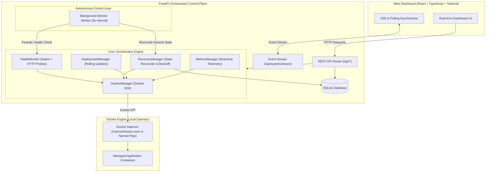

# Lightweight Container Orchestrator with Health Checking & Auto-Restart

A robust, lightweight Docker container orchestration platform inspired by core Kubernetes architectural principles (declarative desired state, autonomous control loops, active health checking, and automatic self-healing recovery), built using the Docker Engine API, FastAPI, SQLite, and a React + Vite dashboard.

---

## Architecture Overview



---

## Core Features

1. **Declarative Desired State vs. Actual State**: 
   - Tracks target states (`running`, `stopped`) in SQLite and continually reconciles against actual Docker container lifecycle states.
2. **Autonomous Background Health Monitor**: 
   - Configurable periodic loop (`HEALTH_CHECK_INTERVAL=5`) evaluating both Docker-native container health status and configurable HTTP probe endpoints (`/healthz`, `/`).
3. **Smart Auto-Restart & Crash Loop Prevention**:
   - Immediate automatic recovery for crashed or unhealthy containers with exponential backoff (`RESTART_BACKOFF_BASE * 2^attempts`).
   - Caps restarts at `MAX_RESTART_ATTEMPTS=5` and marks persistent failures as `restart_failed`.
4. **Lifecycle Audit Trail & Event Logging**:
   - Stores chronological transitions: `DEPLOYMENT`, `CONTAINER_STARTED`, `CONTAINER_STOPPED`, `HEALTH_CHECK_FAILED`, `AUTO_RESTART`, `CONTAINER_RECOVERED`, `UPDATE`, and `RESTART_LIMIT_REACHED`.
5. **Real-Time Resource Telemetry**:
   - Real, non-mocked CPU %, Memory usage/limits, Network I/O (RX/TX), and Block I/O directly sampled from Docker Engine stats API.
6. **Live Terminal-Style Log Viewer**:
   - Stream or poll recent stdout/stderr logs with tail selection, auto-refresh, and one-click clipboard copying.
7. **Safe Rolling Updates**:
   - Pulls target images, creates and health-probes temporary verification containers before retiring the old container to minimize downtime and prevent corrupt image rollouts.
8. **Reconciliation on Boot / Process Restart**:
   - On orchestrator restart, loads registered containers from SQLite, inspects live Docker containers, reconciles discrepancies, and resumes monitoring.
9. **Modern Reactive UI**:
   - Tailwind CSS dark-mode dashboard with cluster metric cards, container status badges, port links, modal inspectors, and live SSE updates.

---

## Technology Stack

- **Backend**: Python 3.11+, FastAPI, Docker SDK for Python (`docker`), Pydantic v2, SQLAlchemy 2.0, SQLite, `httpx`, `uvicorn`.
- **Frontend**: React 19, TypeScript, Vite, Tailwind CSS, Lucide React icons.
- **Testing**: `pytest`, `pytest-asyncio`, FastAPI `TestClient`, and real Docker Engine integration tests.
- **Infrastructure**: Docker Engine, Docker Compose, Windows PowerShell support.

---

## Project Structure

```
LightweightOrchestrator/
├── backend/
│   ├── app/
│   │   ├── api/
│   │   │   ├── containers.py       # Container CRUD, start/stop/restart, logs, stats, update
│   │   │   ├── health.py           # Orchestrator health & Docker connectivity
│   │   │   └── system.py           # Cluster stats & SSE event streaming
│   │   ├── services/
│   │   │   ├── deployment_manager.py # Rolling updates engine
│   │   │   ├── docker_manager.py     # Docker SDK wrapper with named-pipe support
│   │   │   ├── health_monitor.py     # Native Docker health + HTTP probe checking
│   │   │   ├── metrics_manager.py    # Real Docker CPU/Memory/IO parser
│   │   │   └── recovery_manager.py   # Desired state reconciler & exponential backoff
│   │   ├── workers/
│   │   │   └── monitor.py          # Background async health evaluation worker
│   │   ├── config.py               # Pydantic Settings
│   │   ├── database.py             # SQLite engine and session factory
│   │   ├── main.py                 # FastAPI application and lifespan manager
│   │   ├── models.py               # ContainerModel and EventModel SQLAlchemy tables
│   │   └── schemas.py              # Pydantic request and response schemas
│   ├── tests/
│   │   ├── test_api.py             # FastAPI TestClient API tests
│   │   ├── test_docker_integration.py # Real Docker deploy-kill-recover integration test
│   │   └── test_recovery.py        # Unit tests for backoff and state reconciliation
│   ├── Dockerfile
│   └── requirements.txt
├── frontend/
│   ├── src/
│   │   ├── components/
│   │   │   ├── ContainerDetailsModal.tsx # Inspector, telemetry, logs, events, update
│   │   │   ├── ContainerTable.tsx        # Container rows with badges & action buttons
│   │   │   ├── DeployModal.tsx           # Container registration modal
│   │   │   ├── Navbar.tsx                # Header with live Docker Engine badge
│   │   │   └── StatsCards.tsx            # Cluster summary cards
│   │   ├── services/
│   │   │   └── api.ts                    # Typed API client
│   │   ├── types/
│   │   │   └── index.ts                  # TypeScript models
│   │   ├── App.tsx                       # Root view with SSE auto-refresh
│   │   ├── index.css                     # Tailwind CSS v4 styling
│   │   └── main.tsx
│   ├── Dockerfile
│   ├── nginx.conf
│   └── package.json
├── docker-compose.yml
├── pytest.ini
├── run_backend.ps1
├── run_frontend.ps1
├── run_tests.ps1
├── demo_auto_restart.ps1
└── README.md
```

---

## Requirements & Windows Setup

### Docker Desktop Requirements
- **Docker Desktop for Windows** (WSL 2 backend recommended).
- Ensure Docker Desktop is running before launching the orchestrator.
- Verify Docker is responsive in PowerShell:
  ```powershell
  docker version
  ```

### Python Environment
- Python 3.10+ or Python 3.11+.

### Node.js Environment
- Node.js 18+ or 20+ and npm.

---

## Installation & Running

### Option 1: Running Locally on Windows (Recommended for Development)

#### 1. Setup & Start Backend
Open a PowerShell terminal in the project root:
```powershell
.\run_backend.ps1
```
*Or manually:*
```powershell
py -3.11 -m venv .venv
.\.venv\Scripts\pip.exe install -r backend\requirements.txt
.\.venv\Scripts\python.exe -m uvicorn backend.app.main:app --host 0.0.0.0 --port 8088 --reload
```
- **Backend API**: `http://localhost:8088`
- **Swagger Documentation**: `http://localhost:8088/docs`

#### 2. Start Frontend Dashboard
Open a second PowerShell terminal in the project root:
```powershell
.\run_frontend.ps1
```
*Or manually:*
```powershell
cd frontend
npm install
npm run dev
```
- **Frontend URL**: `http://localhost:5173`

---

### Option 2: Running via Docker Compose

```powershell
docker-compose up --build
```
- **Frontend URL**: `http://localhost:5173`
- **Backend URL**: `http://localhost:8088`

---

## Environment Variables Configuration

Copy `.env.example` to `.env`:
```ini
DATABASE_URL=sqlite:///./orchestrator.db
HEALTH_CHECK_INTERVAL=5
MAX_RESTART_ATTEMPTS=5
RESTART_BACKOFF_BASE=5
API_HOST=0.0.0.0
API_PORT=8088
CORS_ORIGINS=http://localhost:5173,http://127.0.0.1:5173,http://localhost:3000,http://127.0.0.1:3000
```

---

## API Endpoints Reference

| Method | Endpoint | Description |
|---|---|---|
| `GET` | `/api/health` | Orchestrator health and Docker connection status |
| `GET` | `/api/system/stats` | Cluster summary counters (running, healthy, restarts) |
| `GET` | `/api/system/stream` | Server-Sent Events (SSE) stream for real-time monitor ticks |
| `GET` | `/api/containers` | List all managed containers with live status |
| `POST` | `/api/containers` | Register & deploy a new container |
| `GET` | `/api/containers/{id}` | Inspect detailed container metadata and audit history |
| `POST` | `/api/containers/{id}/start` | Manually start container |
| `POST` | `/api/containers/{id}/stop` | Manually stop container (sets desired_state="stopped") |
| `POST` | `/api/containers/{id}/restart` | Manually restart container |
| `DELETE` | `/api/containers/{id}` | Stop and remove container from Docker and orchestrator |
| `GET` | `/api/containers/{id}/logs` | Fetch stdout/stderr container logs (supports `?tail=200`) |
| `GET` | `/api/containers/{id}/stats` | Fetch real Docker CPU, memory, network, and block I/O |
| `GET` | `/api/containers/{id}/events` | Fetch full lifecycle event audit trail |
| `POST` | `/api/containers/{id}/update` | Execute safe rolling update to a new image tag |
| `POST` | `/api/containers/{id}/reset-restarts` | Reset restart counter and backoff timer |

---

## Automated Hackathon Demo Scenario

To execute the complete end-to-end hackathon demonstration scenario:

```powershell
powershell -ExecutionPolicy Bypass -File .\demo_auto_restart.ps1
```

### Manual Demo Walkthrough:

1. **Open Dashboard**: Navigate to `http://localhost:5173`.
2. **Deploy Container**:
   - Click **Deploy Container**.
   - Set Name: `demo-nginx`.
   - Set Image: `nginx:alpine`.
   - Set Host Port: `8089` (or any free port).
   - Set Container Port: `80`.
   - Check **Autonomous Auto-Restart**.
   - Health Check: Select **HTTP Probe** (`/`).
   - Click **Deploy Container**.
3. **Verify State**: Dashboard displays `demo-nginx`, status `running`, health `Healthy`.
4. **Trigger Crash**: In an external terminal, run:
   ```powershell
   docker kill demo-nginx
   ```
5. **Observe Auto-Detection**:
   - Within the 5-second interval, status turns `restarting` / `unhealthy`.
   - Event `HEALTH_CHECK_FAILED` and `AUTO_RESTART` are registered.
6. **Observe Self-Healing**:
   - Restart count increments: `0 -> 1`.
   - Container starts and HTTP probe succeeds.
   - Status transitions back to `running` / `Healthy`.
   - Event `CONTAINER_RECOVERED` is recorded in the event history.
7. **View Telemetry & Logs**:
   - Click **Inspect & Metrics** to inspect live CPU %, Memory, and recent access logs.

### Pod Manifest CLI

The project also provides a Kubernetes-style manifest workflow for the problem statement:

```powershell
.\.venv\Scripts\python.exe .\orchestrator_cli.py apply .\manifests\demo-pod.yaml
.\.venv\Scripts\python.exe .\orchestrator_cli.py get
.\.venv\Scripts\python.exe .\orchestrator_cli.py delete demo-nginx
```

The CLI supports `Pod` manifests with one container, image, environment variables, container ports, an optional host port, and HTTP liveness probes. Re-applying an existing manifest updates its image through the rolling-update endpoint.

---

## Running Automated Tests

Run the complete test suite:
```powershell
.\run_tests.ps1
```
*Or directly with pytest:*
```powershell
.\.venv\Scripts\python.exe -m pytest -v
```

### Verified Test Results:
- `backend/tests/test_api.py::test_api_health_endpoint` **PASSED**
- `backend/tests/test_api.py::test_api_system_stats` **PASSED**
- `backend/tests/test_api.py::test_create_container_validation_errors` **PASSED**
- `backend/tests/test_api.py::test_container_not_found` **PASSED**
- `backend/tests/test_docker_integration.py::test_real_docker_auto_recovery` **PASSED**
- `backend/tests/test_recovery.py::test_recovery_stops_container_when_desired_state_is_stopped` **PASSED**
- `backend/tests/test_recovery.py::test_recovery_exceeds_max_restart_attempts` **PASSED**
- `backend/tests/test_recovery.py::test_recovery_respects_exponential_backoff` **PASSED**
- `backend/tests/test_recovery.py::test_recovery_triggers_restart_after_backoff_elapses` **PASSED**
- `backend/tests/test_recovery.py::test_recovery_records_recovery_event_when_healthy` **PASSED**

---

## Known Limitations

1. **Single-Host Port Binding in Rolling Updates**:
   - Because single-node Docker cannot bind two distinct containers to the exact same host port simultaneously on the same network interface, rolling updates perform a fast verification container probe on a dynamic staging port before executing a sub-second atomic container replacement. True zero-downtime port switching requires an external reverse proxy (e.g. Traefik or Envoy).
2. **Windows Process Containers**:
   - The orchestrator defaults to Linux containers managed through Docker Desktop WSL 2 on Windows. Windows-native container mode requires Windows Server containers.
